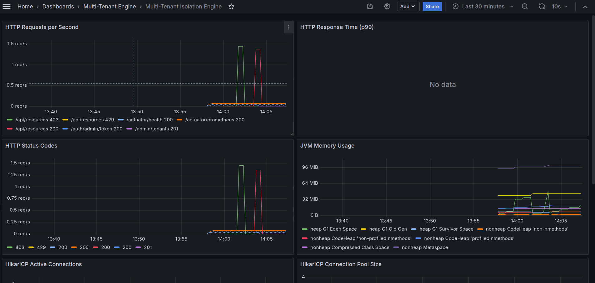
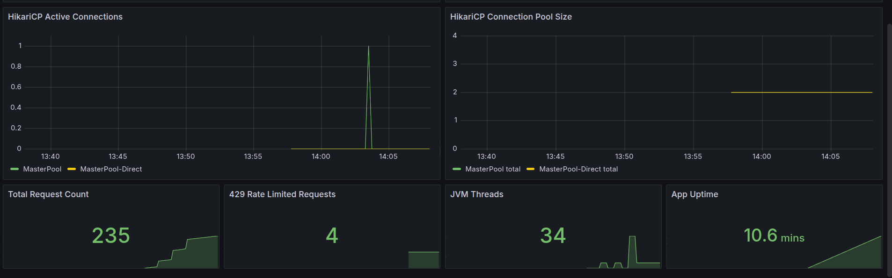

# Multi-Tenant Resource Isolation Engine

> **Production-grade SaaS backend** demonstrating per-tenant rate limiting, dynamic datasource routing, and physical database isolation — where tenant data separation is enforced at the connection pool level, not just the query level.


---

## What This Demonstrates

Most multi-tenant systems isolate data with a `WHERE tenant_id = ?` clause. This engine takes a stronger approach: **each tenant gets a physically separate MySQL database and HikariCP connection pool**. A bug in the application layer cannot leak cross-tenant data because the wrong database simply does not contain the other tenant's rows.

---

## Architecture

```
HTTP Request
     │
     ▼
┌──────────────────────────────┐
│   TenantIdentificationFilter  │  ← Extracts X-Tenant-ID header or JWT claim
│                               │    Returns 401 if missing, 403 if suspended
└───────────────┬──────────────┘
                │ Sets TenantContext (ThreadLocal)
                ▼
┌──────────────────────────────┐
│    RateLimitingInterceptor    │  ← Checks Redis token bucket (Bucket4j)
│                               │    Returns HTTP 429 + Retry-After if exhausted
└───────────────┬──────────────┘
                │ Consumes 1 token
                ▼
┌──────────────────────────────┐
│      Spring @RestController   │  ← Business logic (tenant-scoped)
└───────────────┬──────────────┘
                │ JPA/Hibernate calls
                ▼
┌──────────────────────────────┐
│  TenantAwareDataSourceRouter  │  ← Reads TenantContext → picks DataSource
│  (AbstractRoutingDataSource)  │    Falls back to master when context is empty
└───────┬───────────┬──────────┘
        │           │
   ┌────▼───┐  ┌────▼───┐  ┌──────────┐
   │Tenant A│  │Tenant B│  │  Master  │
   │ MySQL  │  │ MySQL  │  │  MySQL   │
   └────────┘  └────────┘  └──────────┘
                                 ↑
                         Tenant registry,
                         admin operations

Redis ← Bucket4j token buckets per tenant (key: rate_limit:{tenantId})
```

---

## Tech Stack

| Component | Technology | Purpose |
|-----------|-----------|---------|
| Framework | Spring Boot 3.2 | Core application |
| Multi-tenancy | `AbstractRoutingDataSource` | Per-request DB routing |
| Rate limiting | Bucket4j + Redis | Distributed token buckets |
| Database | MySQL 8 | Physical isolation per tenant |
| Migrations | Flyway | Auto schema on tenant provisioning |
| Connection Pool | HikariCP | Tier-based pool sizing |
| Auth | JJWT | Separate tenant + admin JWT keys |
| Containerization | Docker Compose | Full local environment |

---

## Quick Start

### Prerequisites
- Docker & Docker Compose v2+
- Java 17+
- Maven 3.8+

### 1. Clone & Configure

```bash
git clone https://github.com/adarsh-yadav1/multitenant-isolation-engine.git
cd multitenant-isolation-engine
cp .env.example .env
# Edit .env — see required variables below
```

**Required `.env` variables:**
```
MASTER_DB_NAME=saas_master
MASTER_DB_USER=master_user
MASTER_DB_PASSWORD=local_master_pass
MASTER_DB_ROOT_PASSWORD=local_root_pass
TENANT_DB_USER=tenant_user
TENANT_DB_PASSWORD=local_tenant_pass
TENANT_DB_ROOT_PASSWORD=local_root_pass
REDIS_HOST=redis
REDIS_PORT=6379
JWT_SECRET=dev-jwt-secret-minimum-32-characters-long
ADMIN_JWT_SECRET=dev-admin-secret-minimum-32-characters-long
DB_ENCRYPTION_KEY=dev-encryption-key-32-characters
```

### 2. Start

```bash
docker compose up -d
```

Starts:
- `mysql-master` — tenant registry (port 3306)
- `mysql-tenant-a` — Tenant A's isolated DB (port 3307)
- `mysql-tenant-b` — Tenant B's isolated DB (port 3308)
- `redis` — Bucket4j state (port 6379)
- `app` — Spring Boot API (port 8080)
- `adminer` — DB UI (port 8090)

### 3. Get an admin token

```bash
curl -X POST http://localhost:8080/auth/admin/token \
  -H "Content-Type: application/json" \
  -d '{"username": "admin", "password": "admin-secret"}'
```

```json
{
  "token": "eyJhbGci...",
  "username": "admin",
  "type": "Bearer"
}
```

### 4. Register a tenant

```bash
curl -X POST http://localhost:8080/admin/tenants \
  -H "Content-Type: application/json" \
  -H "Authorization: Bearer <admin-token>" \
  -d '{
    "tenantId": "tenant-a",
    "name": "Tenant A Corp",
    "tier": "STARTER",
    "contactEmail": "admin@tenant-a.com",
    "databaseUrl": "jdbc:mysql://mysql-tenant-a:3306/tenant_a?useSSL=false&allowPublicKeyRetrieval=true&serverTimezone=UTC"
  }'
```

Flyway automatically runs `V1__create_tenant_business_schema.sql` on the tenant's database at registration time — no manual setup needed.

### 5. Make tenant API calls

```bash
# Using X-Tenant-ID header
curl http://localhost:8080/api/resources \
  -H "X-Tenant-ID: tenant-a"

# Or using JWT Bearer token
curl -X POST http://localhost:8080/auth/token \
  -H "Content-Type: application/json" \
  -d '{"tenantId": "tenant-a"}'

curl http://localhost:8080/api/resources \
  -H "Authorization: Bearer <tenant-token>"
```

---

## Tenant Isolation Proof

This is the core guarantee of the engine. The following commands were run against a live instance with two registered tenants.

### Setup — create one resource per tenant

```bash
curl -X POST http://localhost:8080/api/resources \
  -H "Content-Type: application/json" \
  -H "X-Tenant-ID: tenant-a" \
  -d '{"name": "Tenant A Secret", "data": "confidential data for A"}'
# → {"id":"2c3836b3-424a-418d-b519-de7b89eb0043", ...}

curl -X POST http://localhost:8080/api/resources \
  -H "Content-Type: application/json" \
  -H "X-Tenant-ID: tenant-b" \
  -d '{"name": "Tenant B Secret", "data": "confidential data for B"}'
# → {"id":"6a7ef419-80a0-4512-9b70-67f0da572a73", ...}
```

### Test 1 — Each tenant sees only their own data

```bash
curl http://localhost:8080/api/resources -H "X-Tenant-ID: tenant-a"
```
```json
[
  {"id":"2c3836b3-424a-418d-b519-de7b89eb0043","name":"Tenant A Secret","data":"confidential data for A"},
  {"id":"600e48e2-2078-4fda-a959-85758b41a93a","name":"My First Resource","data":"some data"}
]
```

```bash
curl http://localhost:8080/api/resources -H "X-Tenant-ID: tenant-b"
```
```json
[
  {"id":"6a7ef419-80a0-4512-9b70-67f0da572a73","name":"Tenant B Secret","data":"confidential data for B"},
  {"id":"ca5c6fd9-aafb-4add-ac79-83d9b3cbeebc","name":"Tenant B Resource","data":"tenant b data"}
]
```

✅ **Each tenant sees only their own resources.**

### Test 2 — Cross-tenant access by UUID returns 404

Even when tenant-b knows tenant-a's exact resource UUID, they cannot access it:

```bash
curl http://localhost:8080/api/resources/2c3836b3-424a-418d-b519-de7b89eb0043 \
  -H "X-Tenant-ID: tenant-b"
```
```json
{
  "type": "https://errors.saas.example/resource-not-found",
  "title": "Resource Not Found",
  "status": 404,
  "detail": "Resource not found: 2c3836b3-424a-418d-b519-de7b89eb0043"
}
```

```bash
curl http://localhost:8080/api/resources/6a7ef419-80a0-4512-9b70-67f0da572a73 \
  -H "X-Tenant-ID: tenant-a"
```
```json
{
  "type": "https://errors.saas.example/resource-not-found",
  "title": "Resource Not Found",
  "status": 404,
  "detail": "Resource not found: 6a7ef419-80a0-4512-9b70-67f0da572a73"
}
```

✅ **Cross-tenant access is impossible — the UUID does not exist in the other tenant's database.**

### Why this is stronger than row-level isolation

With a shared database and `WHERE tenant_id = ?`, a missing filter clause leaks all tenants' data. With physical isolation:

- tenant-a's connection pool **only has connections to `tenant_a` database**
- tenant-b's UUID `6a7ef419...` does not exist in `tenant_a` database at all
- There is no SQL filter to accidentally omit

---

## Rate Limiting

Each tenant tier has a token bucket in Redis. Limits are enforced before any controller logic runs.

| Tier | Requests/min | Burst |
|------|-------------|-------|
| FREE | 60 | 60 |
| STARTER | 200 | 300 |
| PROFESSIONAL | 600 | 900 |
| ENTERPRISE | 2000 | 3000 |

**Response headers on every request:**
```
X-RateLimit-Limit: 200
X-RateLimit-Remaining: 199
```

**When exhausted:**
```
HTTP/1.1 429 Too Many Requests
Retry-After: 12
```

---

# Rate Limiting — Smoke Test & Redis Management

A shell script proves per-tenant token bucket enforcement. The FREE tier allows 60 requests/min — requests beyond that receive `429 Too Many Requests`.

---

## Run the test

```bash
# Reset the bucket first (fresh start)
docker compose exec redis redis-cli DEL rate_limit:free-tier

# Run the script
chmod +x scripts/rate-limit-test.sh
./scripts/rate-limit-test.sh
```

---

## Output

```
━━━━━━━━━━━━━━━━━━━━━━━━━━━━━━━━━━━━━━━━━━━━━━━━━━━━━
  Rate Limit Smoke Test
  Tenant  : free-tier
  Tier    : FREE (60 req/min)
  Sending : 65 requests
━━━━━━━━━━━━━━━━━━━━━━━━━━━━━━━━━━━━━━━━━━━━━━━━━━━━━

[  1] 200 OK  (remaining: 59)
[  2] 200 OK  (remaining: 58)
[  3] 200 OK  (remaining: 57)
...
[ 58] 200 OK  (remaining: 3)
[ 59] 200 OK  (remaining: 2)
[ 60] 200 OK  (remaining: 1)
[ 61] 200 OK  (remaining: 0)   ← last token consumed
[ 62] 429 TOO MANY REQUESTS
[ 63] 429 TOO MANY REQUESTS
[ 64] 429 TOO MANY REQUESTS
[ 65] 429 TOO MANY REQUESTS

━━━━━━━━━━━━━━━━━━━━━━━━━━━━━━━━━━━━━━━━━━━━━━━━━━━━━
  Results
━━━━━━━━━━━━━━━━━━━━━━━━━━━━━━━━━━━━━━━━━━━━━━━━━━━━━
  200 OK          : 61 requests
  429 Throttled   : 4 requests
  First 429 at    : request #62

  429 Response Body:
  {
      "error": "TOO_MANY_REQUESTS",
      "message": "Rate limit exceeded. Retry after 1 seconds.",
      "retryAfterSeconds": 1,
      "rateLimitPerMinute": 60
  }

  ✅ PASS — Rate limiting is working correctly.
         First 60 requests allowed, request #62 was throttled.
━━━━━━━━━━━━━━━━━━━━━━━━━━━━━━━━━━━━━━━━━━━━━━━━━━━━━
```

---

## Why request #61 is allowed

Request #61 shows `remaining: 0` — it consumed the **last token** in the bucket. The FREE tier has a burst capacity of 60, meaning 60 tokens are available at full capacity. All 60 are consumed before throttling kicks in. Request #62 finds an empty bucket and is rejected.

This is correct Bucket4j token bucket behavior — not a bug.

---

## Rate Limit Tiers

| Tier | Requests/min | Burst Capacity |
|------|-------------|----------------|
| FREE | 60 | 60 |
| STARTER | 200 | 300 |
| PROFESSIONAL | 600 | 900 |
| ENTERPRISE | 2000 | 3000 |

---

## Managing Redis Buckets

```bash
# Reset one tenant's bucket (tokens refill immediately on next request)
docker compose exec redis redis-cli DEL rate_limit:free-tier

# Reset ALL tenant buckets at once
docker compose exec redis redis-cli KEYS "rate_limit:*" | \
  xargs docker compose exec -T redis redis-cli DEL

# Inspect a bucket's current state
docker compose exec redis redis-cli GET rate_limit:free-tier

# List all active buckets
docker compose exec redis redis-cli KEYS "rate_limit:*"

# See TTL on a bucket (seconds until token refill window resets)
docker compose exec redis redis-cli TTL rate_limit:free-tier
```

---

## Update a Tenant's Rate Limit (zero-downtime)

Changes take effect on the next request — no restart needed:

```bash
# Step 1 — update limit in master DB via admin API
curl -X PATCH http://localhost:8080/admin/tenants/free-tier/rate-limit \
  -H "Authorization: Bearer <admin-token>" \
  -H "Content-Type: application/json" \
  -d '{"requestsPerMinute": 200}'

# Step 2 — reset Redis bucket so new limit applies immediately
docker compose exec redis redis-cli DEL rate_limit:free-tier
```

Without Step 2, the old bucket config persists in Redis until it naturally expires. With Step 2, the next request rebuilds the bucket with the new limit.

---

## 429 Response Format

```http
HTTP/1.1 429 Too Many Requests
Retry-After: 1
X-RateLimit-Limit: 60
X-RateLimit-Remaining: 0
Content-Type: application/json

{
  "error": "TOO_MANY_REQUESTS",
  "message": "Rate limit exceeded. Retry after 1 seconds.",
  "retryAfterSeconds": 1,
  "rateLimitPerMinute": 60
}
```
---

## API Reference

### Auth
| Method | Path | Description |
|--------|------|-------------|
| POST | `/auth/token` | Issue tenant JWT |
| POST | `/auth/admin/token` | Issue admin JWT |

### Admin (requires admin JWT)
| Method | Path | Description |
|--------|------|-------------|
| POST | `/admin/tenants` | Register + provision tenant |
| GET | `/admin/tenants` | List all tenants |
| PATCH | `/admin/tenants/{id}/status` | Suspend / reactivate |
| PATCH | `/admin/tenants/{id}/rate-limit` | Override rate limit |

### Resources (requires X-Tenant-ID or tenant JWT)
| Method | Path | Description |
|--------|------|-------------|
| GET | `/api/resources` | List tenant's resources |
| POST | `/api/resources` | Create resource |
| GET | `/api/resources/{id}` | Get by ID |
| PUT | `/api/resources/{id}` | Update |
| DELETE | `/api/resources/{id}` | Delete |

Full interactive docs at `http://localhost:8080/swagger-ui/index.html`

---

## Error Responses (RFC 7807)

All errors follow the Problem Detail standard:

```json
{
  "type": "https://errors.saas.example/tenant-not-found",
  "title": "Tenant Not Found",
  "status": 404,
  "detail": "Tenant 'acme' not found",
  "instance": "/api/resources"
}
```

| Scenario | Status |
|----------|--------|
| Missing tenant identifier | 401 |
| Tenant suspended | 403 |
| Admin endpoint without token | 403 |
| Resource not found | 404 |
| Tenant already exists | 409 |
| Validation failure | 400 |
| Rate limit exceeded | 429 |

---
## Observability

Prometheus scrapes `/actuator/prometheus` every 15 seconds. Grafana visualizes per-tenant traffic, rate limit hits, HikariCP pool usage, and JVM metrics.

**Start the observability stack:**
```bash
docker compose up -d
# Grafana: http://localhost:3000 (admin/admin)
# Prometheus: http://localhost:9090
```





---
## Project Structure

```
multi-tenant-engine/
├── scripts/
│   └── rate-limit-test.sh              # Smoke test — proves FREE tier 60 req/min enforcement
│
├── src/
│   └── main/
│       ├── java/com/saas/multitenant/
│       │   ├── config/
│       │   │   ├── CacheConfig.java             
│       │   │   ├── RedisConfig.java             
│       │   │   ├── SecurityConfig.java          
│       │   │   ├── TenantDataSourceConfig.java  
│       │   │   └── WebMvcConfig.java            
│       │   │
│       │   ├── controller/
│       │   │   ├── AdminController.java         
│       │   │   ├── AuthController.java          
│       │   │   ├── QuotaController.java        
│       │   │   └── ResourceController.java  
│       │   │
│       │   ├── domain/
│       │   │   ├── resource/
│       │   │   │   ├── Resource.java          
│       │   │   │   ├── ResourceRepository.java  
│       │   │   │   └── ResourceService.java    
│       │   │   └── tenant/
│       │   │       ├── RateLimitEvent.java             
│       │   │       ├── RateLimitEventRepository.java   
│       │   │       ├── Tenant.java                     
│       │   │       ├── TenantRepository.java          
│       │   │       ├── TenantProvisioningService.java   
│       │   │       ├── TenantService.java               
│       │   │       ├── TenantStatus.java              
│       │   │       └── TenantTier.java                  
│       │   │
│       │   ├── dto/
│       │   │   ├── CreateTenantRequest.java     
│       │   │   ├── QuotaResponse.java           
│       │   │   ├── ResourceRequest.java     
│       │   │   ├── ResourceResponse.java       
│       │   │   └── TenantResponse.java          
│       │   │
│       │   ├── exception/
│       │   │   ├── GlobalExceptionHandler.java      
│       │   │   ├── ResourceNotFoundException.java   # 404 on missing resource
│       │   │   ├── TenantNotFoundException.java     # 404 on unknown tenant
│       │   │   └── TenantSuspendedException.java    # 403 on suspended tenant
│       │   │
│       │   ├── filter/
│       │   │   ├── RequestLoggingFilter.java        
│       │   │   └── TenantIdentificationFilter.java  
│       │   │
│       │   ├── multitenancy/
│       │   │   ├── TenantAwareDataSourceRouter.java  
│       │   │   ├── TenantContext.java               
│       │   │   └── TenantIdentifierResolver.java  
│       │   │
│       │   ├── ratelimit/
│       │   │   ├── RateLimitingInterceptor.java  
│       │   │   └── TenantBucketManager.java     
│       │   │
│       │   ├── security/
│       │   │   ├── AesEncryptionService.java    
│       │   │   ├── JwtAuthFilter.java          
│       │   │   └── JwtTokenProvider.java       
│       │   │
│       │   └── MultiTenantEngineApplication.java
│       │
│       └── resources/
│           ├── application.yml              
│           ├── application-docker.yml     
│           ├── logback-spring.xml           
│           └── db/migration/
│               ├── master/
│               │   └── V1__create_tenant_registry.sql       
│               └── tenant/
│                   └── V1__create_tenant_business_schema.sql  
│
├── docker/
│   ├── grafana/
│   │   └── provisioning/
│   │       ├── dashboards/
│   │       │   ├── dashboards.yml                
│   │       │   └── multitenant-dashboard.json      
│   │       └── datasources/
│   │           └── prometheus.yml                  
│   ├── init-scripts/                              
│   └── prometheus/
│       └── prometheus.yml                          
│
├── docs/
│   └── rate-limiting.md                 # Smoke test output + Redis bucket management guide
│
├── postman/
│   └── postman_collection.json          
│
├── .env.example                         # Required environment variables (no secrets)
├── .gitignore
├── docker-compose.yml                   
├── docker-compose.override.yml          # Dev overrides — debug port 5005, Adminer
├── Dockerfile                           # Multi-stage Maven build → JRE runtime image
├── pom.xml
└── README.md
```
---
## Architecture

See [`docs/architecture.md`](docs/architecture.md) for the full system design including:
- Request lifecycle sequence diagram
- Tenant provisioning flow
- JWT authentication flow
- Datasource routing decision tree
- Rate limiting flow
- Database layout (ER diagram)
- Security layers
---
## Security Design

- Admin and tenant JWTs signed with **separate secret keys**
- `TenantContext` ThreadLocal always cleared in `finally` block
- Flyway migrations run on a **direct datasource** (not the router) during provisioning
- `TenantService` queries master DB via **plain JDBC** to avoid routing to tenant DB
- `.env` is in `.gitignore` — secrets never committed

---

## License

MIT
