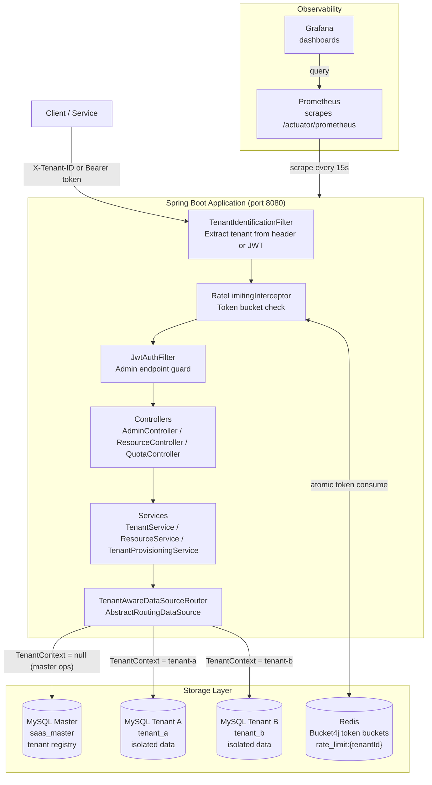
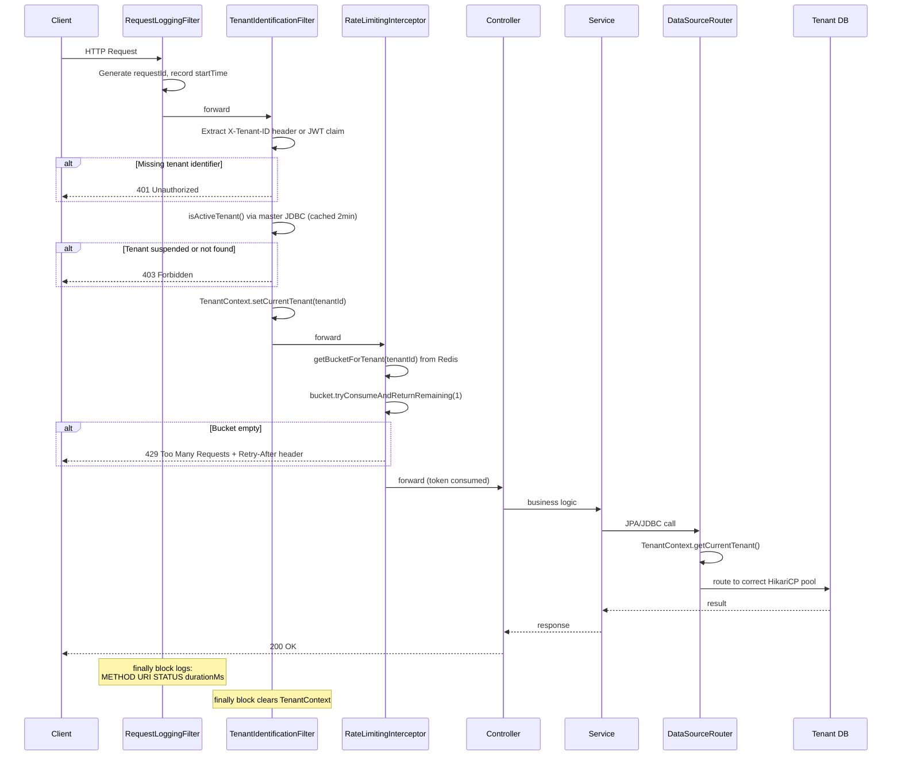
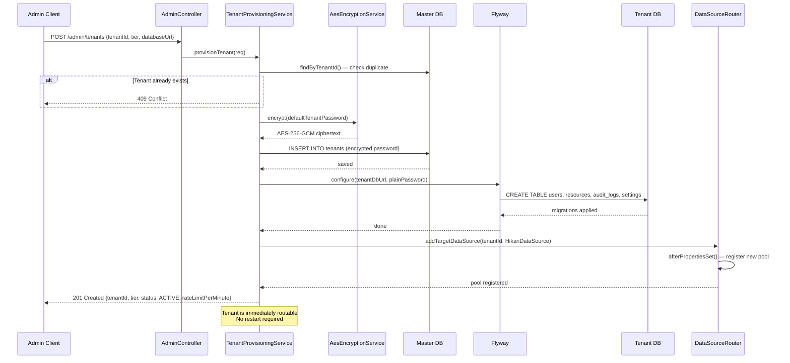
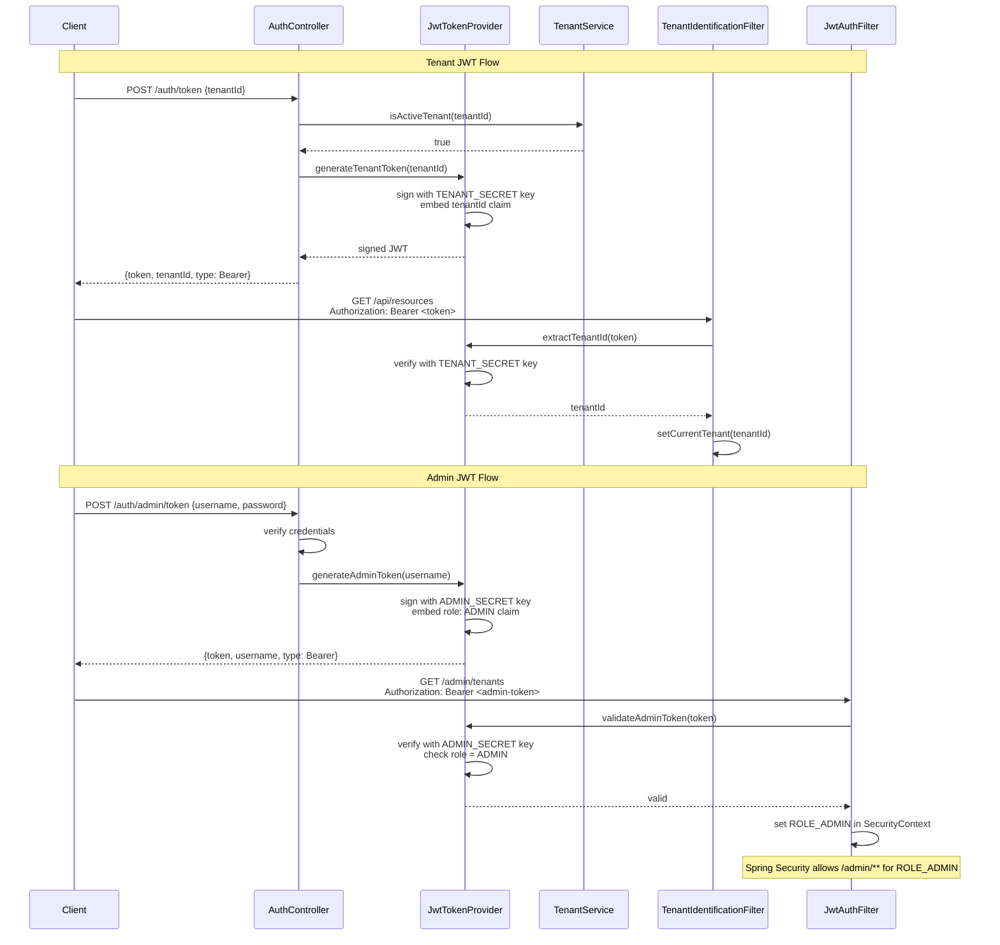
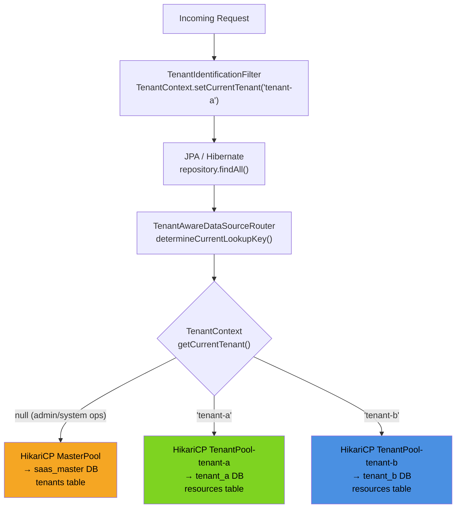
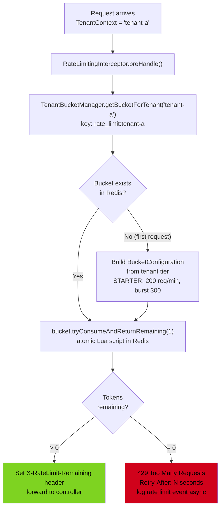
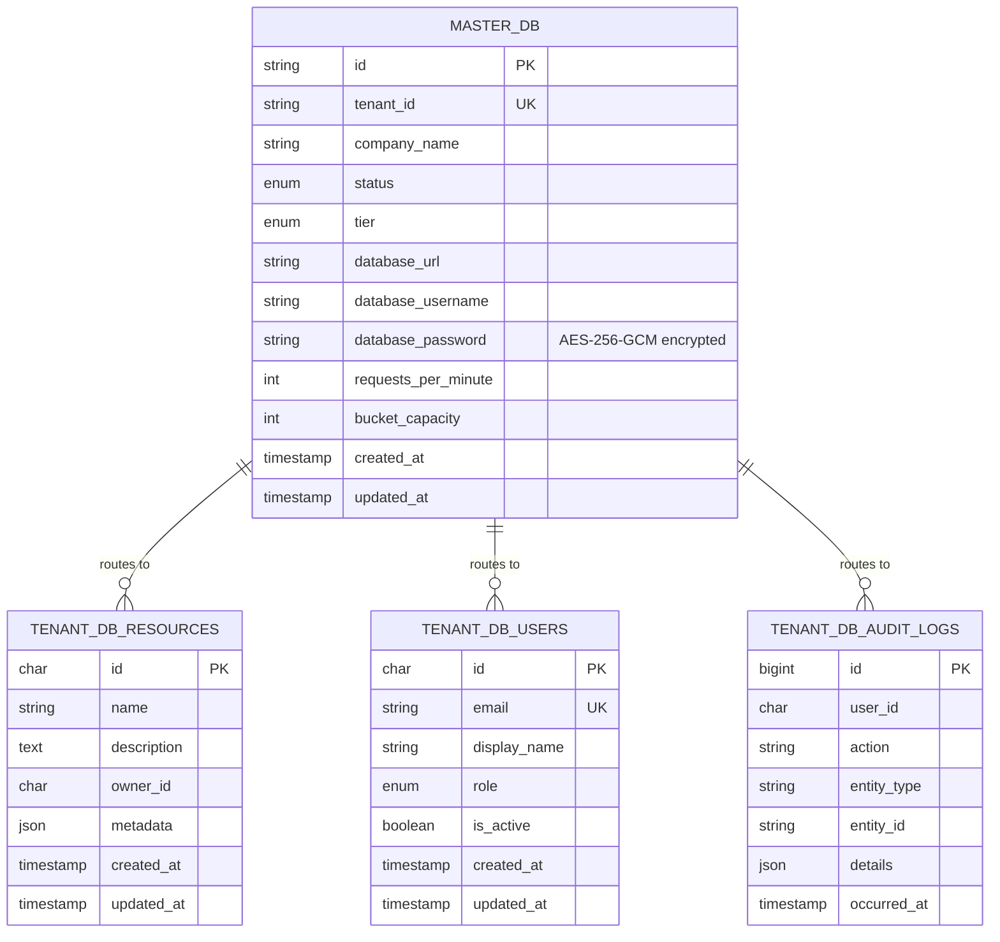
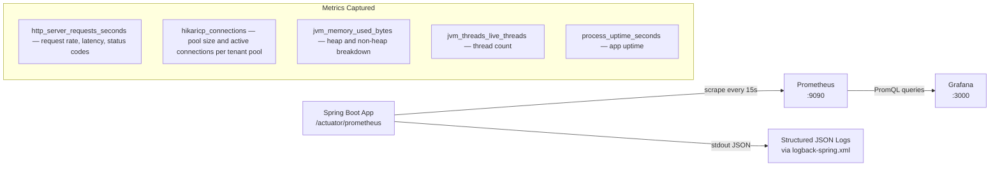

# Architecture

This document describes the system design of the Multi-Tenant Resource Isolation Engine — the key components, how they interact, and the reasoning behind the major structural decisions.

---

## Table of Contents

1. [System Overview](#system-overview)
2. [Request Lifecycle](#request-lifecycle)
3. [Tenant Provisioning Flow](#tenant-provisioning-flow)
4. [JWT Authentication Flow](#jwt-authentication-flow)
5. [Datasource Routing](#datasource-routing)
6. [Rate Limiting](#rate-limiting)
7. [Database Layout](#database-layout)
8. [Security Layers](#security-layers)
9. [Observability](#observability)

---

## System Overview



---

## Request Lifecycle

Every HTTP request passes through this pipeline before reaching a controller:



---

## Tenant Provisioning Flow

When a new tenant is registered via `POST /admin/tenants`:



---

## JWT Authentication Flow

The system uses two separate JWT keys — one for tenants, one for admins:



---

## Datasource Routing

The core of the multi-tenancy engine — how a single JPA layer routes to the correct database:



**Key design decision:** `TenantService` deliberately bypasses the router by using a direct `JdbcTemplate` bound to the master datasource. This prevents the chicken-and-egg problem where validating a tenant requires a DB lookup, which requires knowing the tenant, which requires validation.

---

## Rate Limiting

Per-tenant token bucket stored in Redis, enforced before any controller logic runs:



**Tier configuration:**

| Tier | Requests/min | Burst |
|------|-------------|-------|
| FREE | 60 | 60 |
| STARTER | 200 | 300 |
| PROFESSIONAL | 600 | 900 |
| ENTERPRISE | 2000 | 3000 |

---

## Database Layout



Every tenant gets their own copy of the tenant schema — `resources`, `users`, `audit_logs`, `settings` — in a physically separate MySQL database. The master DB only holds the tenant registry.

---

## Security Layers

Requests pass through multiple independent security checks:

```
Layer 1 — Network
  └── Docker network isolation — containers communicate internally only

Layer 2 — Spring Security (JwtAuthFilter)
  └── /admin/** requires ROLE_ADMIN (validated admin JWT)
  └── /auth/** is public
  └── /swagger-ui/** is public

Layer 3 — TenantIdentificationFilter
  └── /api/** requires X-Tenant-ID header or valid tenant JWT
  └── Tenant must exist in master DB and be ACTIVE

Layer 4 — RateLimitingInterceptor
  └── /api/** token bucket check per tenant
  └── 429 if bucket exhausted

Layer 5 — Physical DB Isolation
  └── Each tenant's HikariCP pool only has connections to their database
  └── Cross-tenant data access is structurally impossible
  └── A missing WHERE clause cannot leak data across tenants

Layer 6 — Encryption at Rest
  └── Tenant DB passwords stored as AES-256-GCM ciphertext in master DB
  └── Decrypted only at datasource initialization time
```

---

## Observability



Every log line includes:
- `timestamp` — ISO-8601
- `level` — INFO/WARN/ERROR
- `message` — human-readable summary
- `tenantId` — which tenant made the request (via MDC)
- `requestId` — unique per request for distributed tracing
- `durationMs` — total request time
- `app` and `env` — for log aggregator filtering